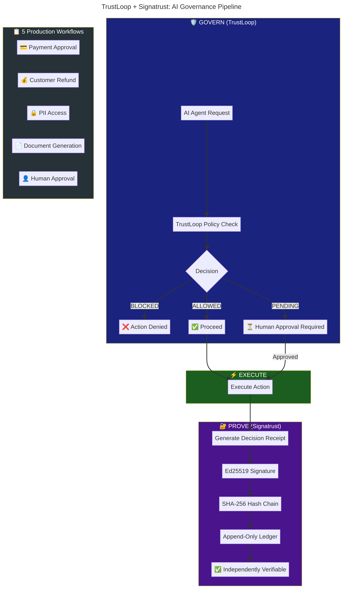
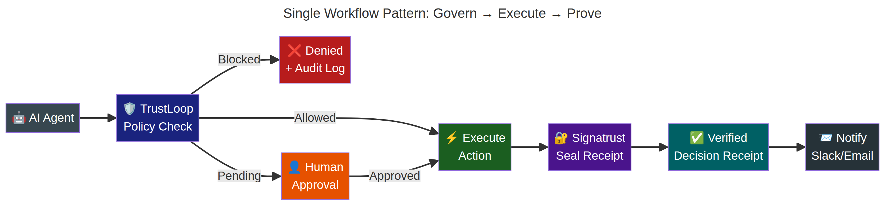

# TrustLoop + Signatrust Integration Pack

**Govern → Execute → Prove**

A production-ready integration pack that combines [TrustLoop](https://trustloop.live) (AI governance layer) with [Signatrust](https://signatrust.net) (cryptographic decision receipts) to create a complete, verifiable AI governance pipeline.



---

## The Problem

AI agents are making autonomous decisions in production — approving payments, issuing refunds, accessing sensitive data, generating contracts. But enterprises face two critical questions from auditors and regulators:

1. **Was this AI action properly governed before execution?** → TrustLoop answers this.
2. **Can you independently prove exactly what happened afterwards?** → Signatrust answers this.

Neither question alone is sufficient. Together, they form a complete governance chain.

---

## How It Works



Every workflow in this pack follows the same three-phase pattern:

| Phase | Tool | What Happens |
|-------|------|--------------|
| **GOVERN** | TrustLoop | AI action is intercepted and evaluated against policies before execution |
| **EXECUTE** | Your Tool | If allowed, the action proceeds (payment, refund, data access, etc.) |
| **PROVE** | Signatrust | The executed action is sealed into a cryptographically signed Decision Receipt |

The Decision Receipt contains:
- **Ed25519 digital signature** — proves authenticity
- **SHA-256 hash chain** — proves ordering and immutability
- **Append-only ledger** — proves nothing was deleted or altered
- **Independent verification** — any auditor can verify without system access

---

## 5 Production Workflows

### 1. AI Payment Approval (`1_ai_payment_approval.json`)

An AI agent requests a wire transfer. TrustLoop checks the amount against policy rules (e.g., "Any transfer over $10,000 requires approval"). If allowed, the transfer executes and Signatrust seals the decision.

**Use case:** Fintech, banking, treasury automation.

### 2. Customer Refund (`2_customer_refund.json`)

An AI support agent proposes a customer refund. TrustLoop applies refund policies (e.g., "Refunds over $500 need manager approval"). If approved, the refund processes via Stripe/payment gateway and Signatrust creates an immutable receipt.

**Use case:** E-commerce, SaaS, customer support automation.

### 3. PII Access Governance (`3_pii_access.json`)

An AI agent requests access to customer personal data. TrustLoop evaluates whether the access is permitted under GDPR/privacy policies. If allowed, the data is retrieved and Signatrust creates a verifiable access receipt proving who accessed what and when.

**Use case:** Healthcare, insurance, any GDPR-regulated environment.

### 4. Document Generation (`4_document_generation.json`)

An AI agent generates a legal contract or official document. TrustLoop checks compliance policies (e.g., "Contracts over $100K need legal review"). If approved, the document is generated and Signatrust seals the approved version with a tamper-proof receipt.

**Use case:** Legal tech, procurement, HR automation.

### 5. Human Approval Flow (`5_human_approval_flow.json`)

A high-risk AI action triggers TrustLoop's human-in-the-loop approval. The request is routed to a human reviewer. After human approval, the action executes and Signatrust documents the entire chain: AI request → human decision → execution → sealed receipt.

**Use case:** Any high-risk decision requiring human oversight with cryptographic proof.

---

## Quick Start

### Prerequisites

- n8n instance (self-hosted or cloud)
- TrustLoop API key ([signup](https://trustloop.live/signup))
- Signatrust API key ([signup](https://signatrust.net))

### Setup

1. **Import any workflow:**
   ```bash
   n8n import:workflow --input=1_ai_payment_approval.json
   ```

2. **Set environment variables in n8n:**
   - `TRUSTLOOP_API_KEY` — your TrustLoop API key
   - `SIGNATRUST_API_KEY` — your Signatrust API key

3. **Configure TrustLoop policies:**
   - Log into your TrustLoop dashboard
   - Add governance rules (e.g., "Block wire transfers over $50,000")
   - Rules are evaluated automatically on every intercept call

4. **Activate the workflow** — every AI action is now governed and sealed.

---

## Integration Architecture

```
┌─────────────────────────────────────────────────────────┐
│                    n8n Workflow                          │
├─────────────────────────────────────────────────────────┤
│                                                         │
│  ┌──────────┐    ┌──────────────┐    ┌──────────────┐  │
│  │ Webhook  │───▶│  TrustLoop   │───▶│  IF: Allowed │  │
│  │ Trigger  │    │ Policy Check │    │              │  │
│  └──────────┘    └──────────────┘    └──────┬───────┘  │
│                                             │          │
│                         ┌───────────────────┼──────┐   │
│                         │ TRUE              │FALSE │   │
│                         ▼                   ▼      │   │
│                  ┌──────────────┐   ┌───────────┐  │   │
│                  │   Execute    │   │  Blocked  │  │   │
│                  │   Action     │   │  Handler  │  │   │
│                  └──────┬───────┘   └───────────┘  │   │
│                         │                          │   │
│                         ▼                          │   │
│                  ┌──────────────┐                   │   │
│                  │  Signatrust  │                   │   │
│                  │ Seal Receipt │                   │   │
│                  └──────────────┘                   │   │
│                                                         │
└─────────────────────────────────────────────────────────┘
```

---

## API Endpoints Used

### TrustLoop — Policy Check
```http
POST https://api.trustloop.live/api/intercept
x-api-key: tl_your_key

{
  "tool_name": "wire_transfer",
  "arguments": { "amount": 5000, "to": "supplier@bank.com" },
  "agent_name": "n8n-workflow"
}
```

**Response:**
```json
{
  "allowed": true,
  "status": "allowed",
  "message": "Action permitted by policy"
}
```

### Signatrust — Seal Decision Receipt
```http
POST https://api.signatrust.net/v1/receipts
Authorization: Bearer sk_your_key

{
  "action": "wire_transfer_executed",
  "payload": { "amount": 5000, "to": "supplier@bank.com" },
  "metadata": { "governed_by": "TrustLoop" }
}
```

**Response:**
```json
{
  "receipt_id": "STR-A1B2C3D4E5",
  "signature": "ed25519:...",
  "hash": "sha256:...",
  "verify_url": "https://signatrust.net/verify/STR-A1B2C3D4E5"
}
```

---

## Phase 1 → Phase 2 → Phase 3

This integration pack represents **Phase 1** — fully functional using HTTP Request nodes and publicly available APIs. No custom integration from either team is required.

| Phase | Description | Status |
|-------|-------------|--------|
| **Phase 1** | HTTP-based integration using available APIs | ✅ Complete |
| **Phase 2** | Replace HTTP with official TrustLoop/Signatrust n8n nodes | 🔜 Next |
| **Phase 3** | Native integration (TrustLoop triggers Signatrust automatically) | 🎯 Goal |

---

## Value for Both Communities

| For TrustLoop Users | For Signatrust Users |
|---------------------|---------------------|
| Cryptographic proof that governed actions actually happened as approved | Pre-execution governance ensures only legitimate actions get sealed |
| Immutable audit trail satisfies regulators beyond just policy enforcement | TrustLoop's policy engine adds intelligent filtering before receipt creation |
| Independent verification without system access | Human-in-the-loop approval documented with tamper-proof evidence |

---

## Contributing

This is an open integration pack. Contributions welcome:
- Additional workflow scenarios
- Alternative notification channels (Teams, Discord, PagerDuty)
- Industry-specific templates (healthcare, finance, legal)

---

## License

MIT

---

## Links

- **TrustLoop:** [trustloop.live](https://trustloop.live)
- **Signatrust:** [signatrust.net](https://signatrust.net)
- **TrustLoop API Docs:** [trustloop.live/docs.html](https://trustloop.live/docs.html)
- **Signatrust ADR Spec:** [signatrust.net/adr](https://signatrust.net/adr)
- **n8n Community:** [community.n8n.io](https://community.n8n.io)
